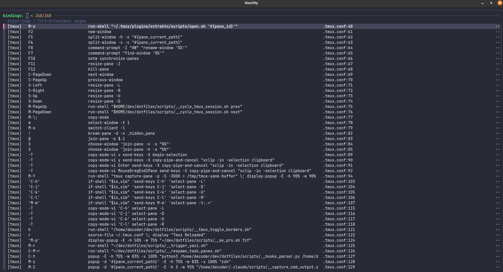

# confhelp

[](https://pypi.org/project/confhelp/)
[](https://pypi.org/project/confhelp/)
[](https://github.com/Piotr1215/confhelp/actions/workflows/publish.yml)
[](https://opensource.org/licenses/MIT)

Find and edit your keybindings instantly.



## The Problem

Over time you accumulate tmux bindings, zsh aliases, vim mappings, custom functions - scattered across dozens of files. You *know* you set something up, but where?

**Two pain points:**

1. **Finding bindings** - "What key did I bind for git status?" "Do I have an alias for docker compose?"
2. **Editing bindings** - You remember it exists, now you need to change it. Which file? What line? grep → open → scroll → find → edit. Every. Single. Time.

## The Solution

```bash
confhelp -b ~/dotfiles --edit
```

Fuzzy search all your bindings → select one → opens `$EDITOR` at exact file:line.

## Install

```bash
pip install confhelp
```

## Usage

```bash
# Output all bindings (uses base_dirs from config)
confhelp

# Interactive fzf selection
confhelp --select

# Select and open in $EDITOR at line
confhelp --edit

# JSON output
confhelp -f json

# Override base directory
confhelp -b ~/other-dotfiles

# Show keys defined more than once
confhelp --conflicts

# Report lines that look like bindings but failed to parse
confhelp --check
```

Example output:

```
[tmux]   prefix+g   display-popup -w 80%...   .tmux.conf:42
[alias]  gs         git status                .zsh_aliases:15
[bind]   ^[e        edit-command-line         .zshrc:89
```

The `--edit` flag drops you directly into the file at the exact line. Change the binding, save, done.

## Binding Sources

confhelp supports two ways to extract bindings:

### 1. Regex Parsing (data-driven)

Define patterns in TOML to extract bindings from config files. Works for any text-based config format - tmux, zsh, aliases, etc. You specify `paths`, `regex`, and capture groups.

### 2. Query Engines (code-driven)

Some tools (like nvim) store bindings in ways that can't be reliably parsed with regex - runtime keymaps, plugin-generated bindings, multi-line table formats. Query engines run the tool itself to extract bindings.

Currently available: `nvim` (runs nvim headlessly to query keymaps)

**Architecture note:** Query engines are currently hardcoded. Future versions may support registering custom extractors - any code that returns `(type, key, desc, file, line)` tuples could become a binding source. This would allow community-contributed engines for tools like vim, emacs, i3, sway, etc.

## Config Format

Define parsers in TOML. Each section describes how to extract bindings from a set of files:

```toml
# Default directories to search (no -b needed)
base_dirs = ["~/dotfiles", "~/work-dotfiles"]

# Query engines - run external tools to get bindings
# Available: "nvim" (queries nvim headlessly for keymaps)
query_engines = ["nvim"]

# tmux: bind [-n] <key> <command>
# Example: bind r source-file ~/.tmux.conf
#          bind-key -n M-l popup -E lazygit
# Captures: (1) key=r or M-l, (2) command
[tmux]
paths = [".tmux.conf"]
match_line = "^bind"
regex = 'bind(?:-key)?\s+(?:-n\s+)?(\S+)(.*)'
key_group = 1
desc_group = 2
type = "tmux"
truncate = 100

# zsh alias: alias [-gs] <name>=<command>
# Example: alias gs='git status'
#          alias -g C='| xsel --clipboard'
# Captures: (1) name=gs or C, (2) command
[alias]
paths = [".zsh_aliases", ".zsh_claude"]
regex = "alias\\s+(?:-[gs]\\s+)?([^=]+)=(.*)"
key_group = 1
desc_group = 2
type = "alias"
strip_quotes = true

# zsh-abbr: "abbrev" 'expansion'
# Example: "ga" 'git add'
# Captures: (1) abbrev=ga, (2) expansion=git add
[abbrev]
paths = [".zsh_abbreviations"]
match_line = '".*"'
regex = '''"([^"]+)"\s+'([^']+)''''
key_group = 1
desc_group = 2
type = "abbrev"

# nvim query engine options
[engine.nvim]
truncate = 60

# nvim via regex (alternative to query engine - parses source files directly)
# Only catches single-line vim.keymap.set calls with inline desc
[nvim-regex]
paths = [".config/nvim/lua/**/*.lua"]
match_line = "vim.keymap.set"
regex = 'vim\.keymap\.set\([^,]+,\s*"([^"]+)".*desc\s*=\s*"([^"]+)"'
key_group = 1
desc_group = 2
type = "nvim"
```

### Config Options

**Top-level options:**

| Option | Description |
|--------|-------------|
| `base_dirs` | Default directories to search |
| `query_engines` | List of query engines to enable (e.g., `["nvim"]`) |

**Section options:**

| Option | Description |
|--------|-------------|
| `paths` | List of files or glob patterns (e.g., `**/*.lua`) |
| `regex` | Pattern with capture groups for key/desc (Python `re` syntax) |
| `key_group` | Capture group number for the key |
| `desc_group` | Capture group number for description |
| `match_line` | Only process lines matching this pattern |
| `skip_comment` | Skip lines starting with `#` |
| `truncate` | Max length for description |
| `strip_quotes` | Remove surrounding quotes from desc |
| `desc_literal` | Use fixed string as description |
| `desc_from_comment` | Extract desc from trailing `# comment` |

### Regex Tips

Patterns use Python's [`re`](https://docs.python.org/3/library/re.html) module. Test patterns at [regex101.com](https://regex101.com/) (select Python flavor).

Quick CLI test:
```bash
echo "bind r reload" | python -c "import re,sys; m=re.search(r'bind\s+(\S+)\s+(.*)', sys.stdin.read()); print(m.groups() if m else 'no match')"
```

## Output Formats

- `pipe` (default): pipe-delimited `[type]|key|desc|file:line`
- `tsv`: Tab-separated
- `json`: JSON array

The pipe format works well with `column -t -s'|'` for aligned display.

## Integration Examples

`confhelp` outputs text. How you display it is up to you.

### fzf with Multiple Actions

Use `--expect` to handle different keys. Ctrl+P extracts and opens paths from entries:

```bash
result=$(confhelp -b ~/dotfiles | column -t -s'|' | fzf \
    --header='Enter=edit | Ctrl-P=open path | Ctrl-O=copy' \
    --expect=ctrl-p,ctrl-o)

key=$(echo "$result" | head -1)
selection=$(echo "$result" | tail -1)

case "$key" in
    ctrl-p)
        # Extract path from selection (supports /, ~, $HOME prefixes)
        path=$(echo "$selection" | grep -oE '(/[^ ]+|~[^ ]+|\$HOME[^ ]+)' | head -1)
        path="${path/#\~/$HOME}"
        [[ -e "$path" ]] && $EDITOR "$path"
        ;;
    ctrl-o)
        echo "$selection" | xsel -ib
        ;;
    *)
        # Enter: parse file:line and open in editor
        file_line=$(echo "$selection" | awk '{print $NF}')
        file="${file_line%:*}"
        line="${file_line##*:}"
        $EDITOR "+$line" "$file"
        ;;
esac
```

### Alacritty Popup

Spawn a centered popup window:

```bash
alacritty --class popup -e bash -c 'confhelp -b ~/dotfiles --edit'
```

See `examples/alacritty-popup.sh` for a complete implementation with Ctrl+P path support.

### tmux Popup

```bash
tmux display-popup -w 80% -h 80% -E 'confhelp -b ~/dotfiles --select'
```

### Rofi/dmenu

```bash
confhelp -b ~/dotfiles | rofi -dmenu
```

## Acknowledgments

Inspired by [Extracto](https://github.com/sarthakbhatkar1/Extracto).

## License

MIT
